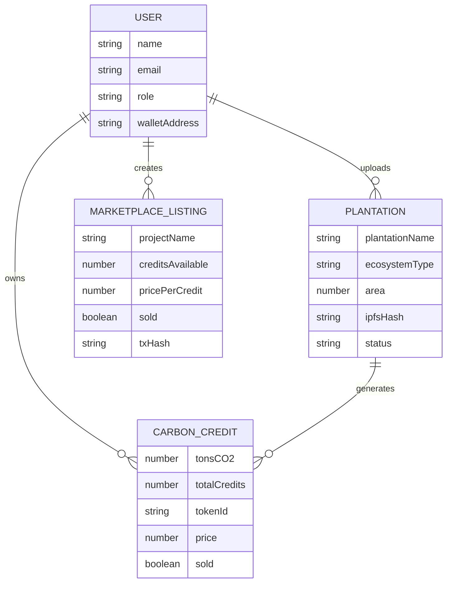

# ER Diagram

```mermaid
erDiagram
  USER ||--o{ PLANTATION : uploads
  USER ||--o{ MARKETPLACE_LISTING : creates
  USER ||--o{ CARBON_CREDIT : owns
  PLANTATION ||--o{ CARBON_CREDIT : generates

  USER {
    string name
    string email
    string role
    string walletAddress
  }
  PLANTATION {
    string plantationName
    string ecosystemType
    number area
    string ipfsHash
    string status
  }
  CARBON_CREDIT {
    number tonsCO2
    number totalCredits
    string tokenId
    number price
    boolean sold
  }
  MARKETPLACE_LISTING {
    string projectName
    number creditsAvailable
    number pricePerCredit
    boolean sold
    string txHash
  }
```
